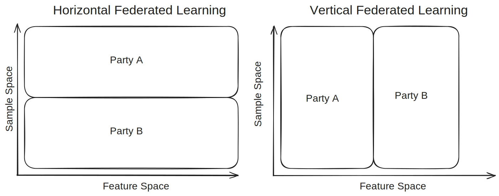
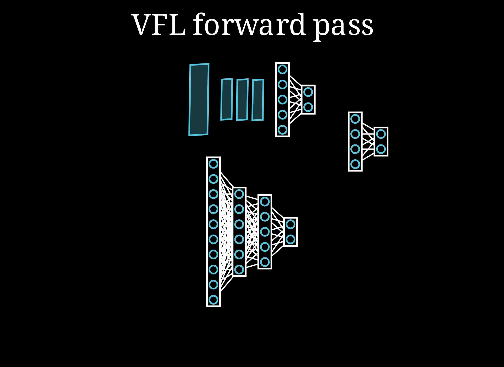

# Federated Learning

What is federated learning?

The term federated learning was coined by McMahan et al. in their paper [Communication-Efficient Learning of Deep Networks from Decentralized Data](https://proceedings.mlr.press/v54/mcmahan17a.html). It is a method to train a machine learning model from a decentralized dataset. 

It is mainly used to train on data that cannot be shared, e.g. for legal or economic reasons.
For example medical records or private data from a users smartphone, like the messages they typed or photos. This kind of data must be protected and kept only locally on the clients devices.

But nevertheless, they provide valuable training data for machine learning application. Medical records can be used to develop models that can help diagnose illnesses, text data can improve autocorrection suggestions and image data can be used to improve face and object detection models.

Federated learning can be used to train ML models from this data, without the need to store it on a central server.

Datasets can be split in two ways, in feature space and in sample space. 
If the data is split in sample space, then that means that multiple parties have (disjoint) datasets with the same features samples with this feature space. For example the images on users smartphones all share the same feature space, but are different images.

If the data is split in feature space then the participating parties have data on the same entity but of different types. For example, an online retailer and a bank may have data on shared customers and they might want to work together to create a model that benefits from both partial datasets.

This distinction in the shape of the shared dataset requires different approaches to learning from that data.
**Horizontal Federated learning** is used for data that is split in sample space, but has the same features, while **vertical federated learning** is used to train on datasets that are split in feature space.

## Horizontal Federated Learning
#Todo

Data:
1. often unbalanced, non-IID
2. same features, different samples

Training HFL:  

One round:
1. Shared global model is send to a random set of $m$ clients.
2. Those clients train for some number of iterations on their local dataset
3. Clients send the $\Delta$ difference between the global model and their new local model back to the server
4. The server aggregates all the updates and adds the average of the updates (scaled by a learning factor) to the global model for the next round

## Vertical Federated Learning

### Split Learning

### Attacks on VFL

[BadVFL](BadVFL/README.md)

### Defenses against attacks on VFL
[VFLIP](VFLIP/README.md)

## This Codebase

Animation.ipynb contains code to visualize the concepts related to federated learning. It used the Manim and ManimML libraries.

VFL Sandbox.ipynb contains a simple example on how vertical federated learning is applied to the Fashion-MNIST dataset. The feature space is split in half. One client has the top half of all the images, the other has the bottom half. A server has the labels.
The parties learn a split neural network that achieves close to the same level of accuracy as a centralized approach.

## References
McMahan, Brendan, Eider Moore, Daniel Ramage, Seth Hampson, and Blaise Aguera y Arcas. ‘Communication-Efficient Learning of Deep Networks from Decentralized Data’. In Proceedings of the 20th International Conference on Artificial Intelligence and Statistics, 1273–82. PMLR, 2017. https://proceedings.mlr.press/v54/mcmahan17a.html.
