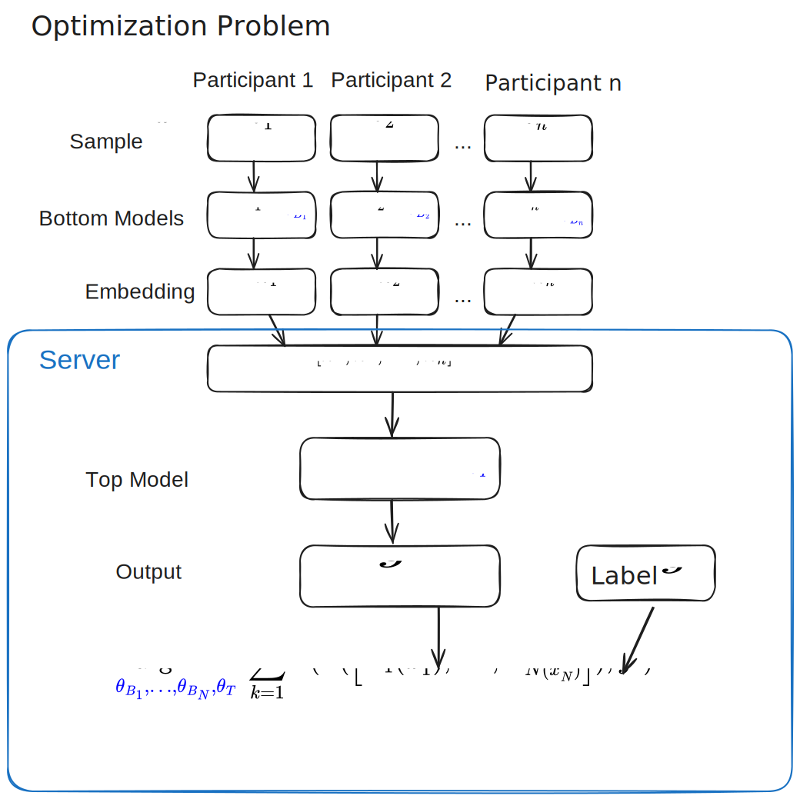

# VFLIP
#todo

- Defense against backdoor attacks on VFL (e.g. [BadVFL](../BadVFL/README.md))

## Training for VFL

Initialization:
1. ID alignment (find overlap between the participant's dataset)
   - e.g. Private set intersection

Training rounds:
1. Batch index selection
2. Bottom model forward pass
   -   Participants send embeddings to server
3. Top model forward pass
4. Top model backward propagation
   - Server sends gradients for each participant's embeddings back
5. Bottom model backward propagation

## Backdoor Attack
Goal:
- model correctly predicts clean samples
- misclassifies backdoor-triggered samples as target label

Capabilities of the attacker:
- one or more attackers among participants (but less than half)
- Attacker can modify their local data and/or embeddings
- Cannot modify anything on the server or other, non-malicious, participants
- May or may not have label knowledge of their training set
  - If they don't, then they have access to a small labeled auxilliary dataset
- Cannot change the labels

## Method

## References
Cho, Yungi, Woorim Han, Miseon Yu, Younghan Lee, Ho Bae, and Yunheung Paek. ‘VFLIP: A Backdoor Defense for Vertical Federated Learning via Identification and Purification’. In Computer Security – ESORICS 2024, edited by Joaquin Garcia-Alfaro, Rafał Kozik, Michał Choraś, and Sokratis Katsikas, 291–312. Cham: Springer Nature Switzerland, 2024. https://doi.org/10.1007/978-3-031-70903-6_15.
